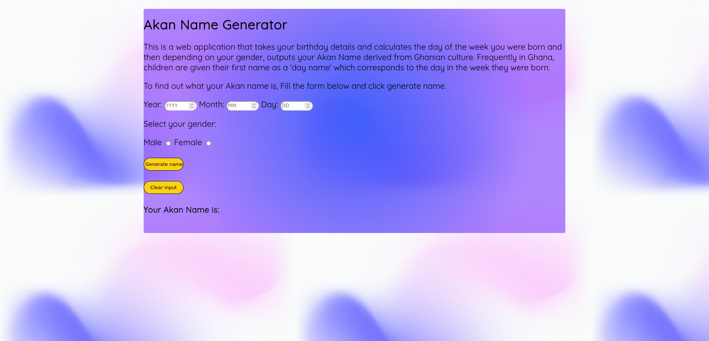
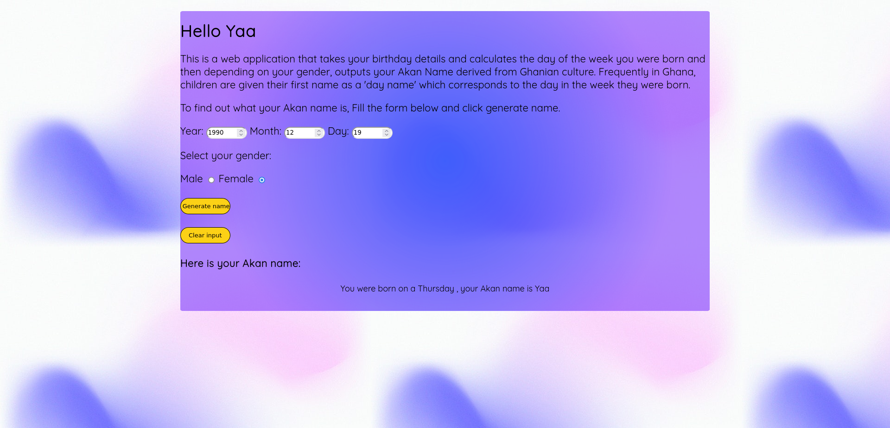

# Akan Name Generator
#### Web app that generates an Akan name based on the date of birth and gender by determining the day one was born, 30/09/2022

## Author
Racheal Kinyua

## Versioning
Akan-name-generator V1.0

## Description
Akan names are derived from Ghanian culture. Frequently in Ghana, children are given their first name as a 'day name' which corresponds to the day in the week they were born. Here are Ghanian day names. T
This app will take in a user's year of birth, month of birth, day of birth and select gender.

## Features
Summary Features:
The app accepts the following Inputs.

* Day of Birth
* Month of birth.
* Year of birth.
* Gender.

##

Outputs

* Generated Akan Name

## Installation and Set-up

To view the app, open the Github Pages link provided below on the README.
Setup and Run

* Step 1 : Clone this repository using **https://github.com/rkinyua5/rkinyua5.github.io**
* Step 2 : Extract ZIP
* Step 3 : Open the index.html

## Run Application

* To view my application online, follow this link **https://rkinyua5.github.io**

## Technologies

* HTML  
* CSS
* Javascript

## Support and contact details

You can provide feedback:
* rkinyua5@gmail.com

## License
#### *MIT License*

The MIT License

Permission is hereby granted, free of charge, to any person obtaining a copy
of this software and associated documentation files (the "Software"), to deal
in the Software without restriction, including without limitation the rights
to use, copy, modify, merge, publish, distribute, sublicense, and/or sell
copies of the Software, and to permit persons to whom the Software is
furnished to do so, subject to the following conditions:

copyright (c) 2022 **Racheal Kinyua**
